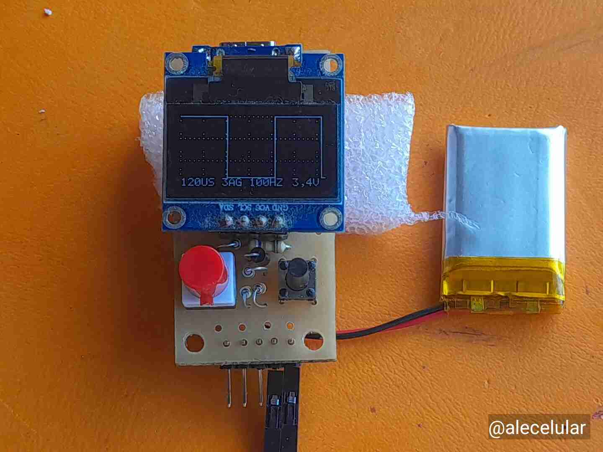

# Nano Oscilloscope with ATtiny85

Simple digital oscilloscope based on ATtiny85 with OLED display.
👉 English version README_en.md
👉 Spanish version below

---

# Nanoosciloscopio con ATtiny85

Osciloscopio digital simple...# Nanoosciloscopio con ATtiny85

Osciloscopio digital simple basado en ATtiny85 con visualización en OLED.

## Características
- Muestreo rápido por ADC.
- Visualización en pantalla.
- Generador de señal integrado.
- Escala de tiempo: 10 µs a 8160 µs por punto.
- Mide señales de amplitud de 1V, 3,3V, 5V o 12V, según selección.
- Puede mostrar señales desde 1 Hz, hasta aproximadamente 10 kHz
- Solo para señales de valores positivos.
- Versión inicial para publicación. Faltan detalles que iré agregando.
## Hardware necesario
- ATtiny85 (principal), adaptable a ATmega328P.
- OLED SSD1306.

### Componentes
- R1 10 kΩ
- R2 10 kΩ
- R3 10 kΩ
- R4 100 kΩ
- R5 47 kΩ   (PUL1)
- R6 4,7 kΩ
- R7 12 kΩ
- R8 47 kΩ
- R9 8,2 k
- R10 6,8 kΩ (PUL 2) Solo para placa de 3 pulsadores
- R11 22 kΩ  (Pul 3) Solo para placa de 3 pulsadores
- C1 15 pF
- C2 15 pF 
- C3 10 µF
- C4 100 nF
- DS1=DS2 Schottky
- DZ1 Zener 3,3 V.
- Conectores varios.
- Pulsadores.

 Opcionales:
- Interruptor.
- Circuito impreso
- Módulo de carga tipo TP4056
- Batería de litio o similar, de 3,7 V
- Cristal. Da la precisión del equipo. (El de 8 MHz funciona con batería de litio, y el de 16 MHz solo con 5 V, aunque a veces funciona con una batería de litio bien cargada)

## Conexiones
(ver hardware/Esquematico_Nano-Osciloscopio_2026-04-01.png)

## Cómo usar
1. Cargar el código con el IDE de arduino en una carpeta llamada NOS_V1.5.0 (archivos NOS_V1.5.0.ino e I2C.ino).
2. Compilar, si se quiere para uno o dos pulsadores, tipo de OLED (128x64 es 8, 128x32 es 4).
3. Compilador y opciones están indicadas dentro del NOS_V1.5.0.ino y su complemento I2C.ino.
4. Se puede usar un ATmega328P para ensayos (ARDUINO, Nano, Pro Mini), pero no he diseñado circuito impreso para ello.
5. Si se usa cristal, usar la opción de calibración de tensiones de entrada dentro de CONFIG.
6. Si no se usa cristal adicionalmente calibrar la frecuencia con una señal de 50 Hz o 60 Hz.
7. Conectar la señal a la entrada (rangos soportados: 1 V, 3.3/5 V o 12 V según configuración).
8. Ajustar parámetros,

## Limitaciones
- Ancho de banda limitado,
- Resolución ADC,

## Autor
Alejandro F. Fernández  
nanoosciloscopio@gmail.com

## Licencia
Uso no comercial.

Si querés usarlo comercialmente, contactame:
nanoosciloscopio@gmail.com

Se agradece informar mejoras o errores.

