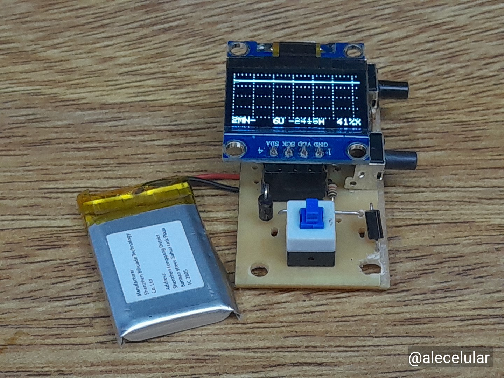
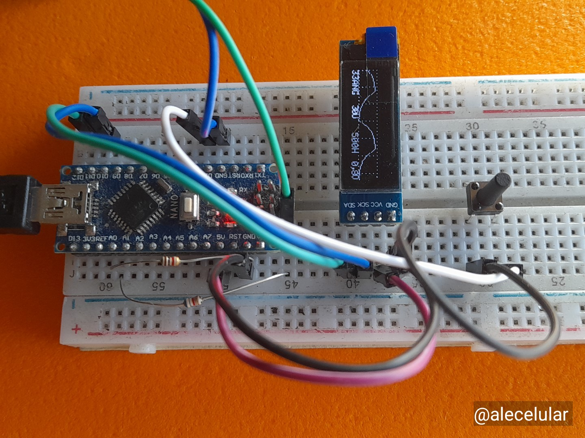
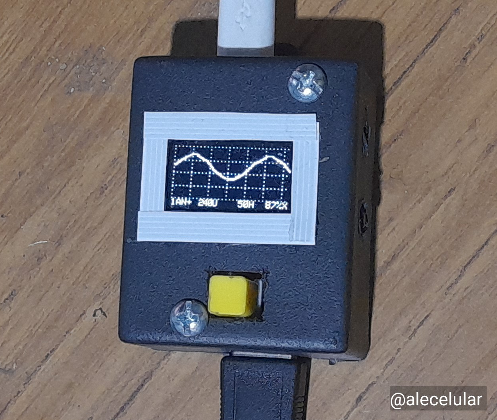

# Nanoosciloscopio con ATtiny85

Osciloscopio digital compacto basado en ATtiny85, con pantalla OLED,
generador de funciones, frecuencímetro y modo sensor de temperatura
integrados, diseñado para funcionar con una cantidad mínima de
componentes (solo 5 pines de I/O en el ATtiny85). También compila,
sin cambiar la lógica del programa, para **ATmega328P** (Arduino
Nano / Pro Mini).

👉 English version [README_en.md](README_en.md)

👉 Versión en castellano, a continuación

> **Nota:** este repositorio reemplaza al prototipo anterior de este
> mismo proyecto. La versión actual (**V1.9.5**) tiene un circuito
> impreso propio (**NOS41**), un esquema de pulsadores distinto al
> del prototipo original, y agrega el modo sensor de temperatura.
> Algunos detalles del diseño previo (circuito impreso, cantidad y
> tipo de pulsadores, fotos) ya no aplican tal cual — quedan
> documentados acá solo los que siguen vigentes en esta versión.

Detalle de armado:
[](Fotos/ATtiny85/IMG_20260527_131120.jpg)

Prototipo con Arduino Nano y pantalla de 128x32
[](Fotos/Arduino_NANO_128x32/IMG_20260410_170244.jpg)

Equipo armado mostrando la frecuencia de línea de 50 Hz.
Nótese un conector para cargar la batería, el conector de entrada y pulsadores laterales.
[](Fotos/50Hz.png)

---

## Especificaciones

- **MCU:** ATtiny85 (principal), adaptable a ATmega328P.
- **Display:** OLED SSD1306 (128x64 / 128x32) por I2C bit-banged
  (sin `Wire.h`, sin librería gráfica).
- **Escala de tiempo:** ajustable, calibrada específicamente para
  cristales de 8, 12, 16 y 20 MHz (con corrección de fase en los
  que no dan un múltiplo entero de µs).
- **Resolución:** 8 bits (ADC interno del AVR).
- **Selección de modo:** un único pin ADC con selector resistivo —
  sin pines dedicados por función.
- **Funciones integradas:**
  * Osciloscopio (autoescala, disparo por flanco, modo línea o
    puntos, barrido libre o gatillado, "estirar" x4, congelar
    captura).
  * Generador de funciones (onda cuadrada, 1 Hz a 25 kHz).
  * Frecuencímetro (hasta ~1 MHz en señales cuadradas).
  * Sensor de temperatura (DS18B20 o DHT11/DHT22, configurable).
- Menú completo en pantalla para calibración, sin PC conectada.

---

## Hardware necesario

- ATtiny85 (principal), adaptable a ATmega328P. Requiere **cristal
  externo** para mediciones de tiempo/frecuencia precisas (no
  funciona con el RC interno).
- OLED SSD1306 (128x64 u 128x32, configurable por `#define`).
- Circuito impreso propio: **NOS41** — ver [`hardware/`](hardware/)
  (fuente en `nos41.xcf`).
- 2 pulsadores.
- Opcional: módulo de carga tipo TP4056 + batería de litio 3,7 V,
  interruptor.

### Pines — ATtiny85

| Pata | Función              | Señal        |
|------|----------------------|--------------|
| 1    | RESET / Selector     | PB5/ADC0     |
| 2    | Cristal A            | PB3/ADC3     |
| 3    | Cristal B            | PB4/ADC2     |
| 4    | MASA                 | 0 V          |
| 5    | SDA' (I2C bitbang)   | PB0/AIN0     |
| 6    | SCL' (I2C bitbang)   | PB1/AIN1     |
| 7    | Sal/Ent/Frec/Sensor  | PB2/ADC1/T0  |
| 8    | Alimentación         | VCC          |

### Pines — ATmega328P (Arduino Nano, probado)

| Función           | Pata  | Señal |
|-------------------|-------|-------|
| Sal/Ent/Sensor     | A0    | PC0   |
| Frecuencímetro     | D5    | PD5   |
| SDA' (bitbang)     | D9    | PB1   |
| SCL' (bitbang)     | D10   | PB2   |
| Pulsador 1         | D2    | PD2   |
| Pulsador 2         | D7    | PD7   |
| Selector           | A1    | PC1   |
| Capacitor AREF     | AREF  | VREF  |

> ⚠️ **Corrección respecto a documentación de versiones previas:**
> en el ATmega328P, la salida del **generador de funciones usa el
> mismo pin A0/PC0** que la entrada del osciloscopio y del sensor —
> no un pin independiente D8/PB0 como se había descrito en algún
> momento. Ver `activarGenerador()` en el código: para ATmega328P
> alterna `PINC=(1<<PC0)` (configurado como salida con
> `DDRC|=(1<<PC0)`), y solo en ATtiny85 usa un pin propio (PB2), por
> ser el único disponible además del selector y el bus I2C.

Esquemáticos completos en [`hardware/`](hardware/):
- `Esquema_Nano-Osciloscopio_ATtiny85.pdf` / `.json`
- `Esquema_Nano-Osciloscopio_ATmega328P.pdf` / `.json`
- `nos41.xcf` — diseño de circuito impreso NOS41.

### Selector de modo (una resistencia hace todo)

| Resistencia | ADC aprox. | Modo             |
|-------------|-----------:|------------------|
| Abierto (∞) | ~245–255   | Osciloscopio 'X' |
| —           | ~144–158   | Osciloscopio 'Y' |
| 3,9 kΩ      | ~167       | Osciloscopio 'Z' |
| 12 kΩ       | ~188       | Generador        |
| 33 kΩ       | ~214       | Frecuencímetro   |
| 100 kΩ      | ~236       | Sensor           |

Los valores se guardan en EEPROM y se recalibran desde el propio
menú, para compensar la tolerancia real de las resistencias que uses.

---

## 📷 Evolución del prototipo

Las fotos en [`Fotos/ATtiny85/`](Fotos/ATtiny85/) documentan tres
etapas del desarrollo:

1. **Placa NOS41 grabada** (14/05) — el circuito impreso recién
   hecho, todavía sin componentes.
2. **Prototipo previo en protoboard** (15/05) — un armado anterior
   sobre placa perforada, usado para probar la lógica antes de
   pasar al impreso definitivo.
3. **NOS41 armada** (27/05 en adelante) — la placa final con todos
   los componentes soldados, OLED y batería.

En [`Fotos/Arduino_NANO_128x32/`](Fotos/Arduino_NANO_128x32/) hay
además fotos del armado de pruebas sobre un Arduino Nano con OLED
de 128x32.

---

## ⚡ Sección Generador de Funciones

Permite generar ondas cuadradas entre **1 Hz y más de 20 kHz**.
* **Funcionamiento:** Reconfigura el Timer y utiliza el pin de
  entrada como salida.
* **Precisión:** Si la frecuencia es exacta, se muestra el símbolo
  `=`. Si es una aproximación, se muestra `#`.
* **ATmega328P:** La salida se genera en el **mismo pin de
  entrada/sensor (A0/PC0)** — no en un pin independiente — para no
  sumar un pin dedicado más allá de los ya usados por osciloscopio
  y sensor.

## 📈 Sección Frecuencímetro

Mide frecuencias de ondas cuadradas (nivel lógico 0 a VCC)
inyectadas en el pin de entrada, alcanzando fácilmente **1 MHz**.
* **ATtiny85:** Utiliza el contador interno **T0**. Es fundamental
  compilar sin `millis()` para evitar conflictos con el contador de
  tiempo.
* **ATmega328P:** Utiliza el contador **T1** en el pin **D5**, lo
  que permite separar la entrada de medición de la de frecuencia.
* *Nota:* Para señales menores a 10 kHz que no sean cuadradas, se
  recomienda usar el **Modo Osciloscopio**.

---

## 🚀 Introducción

La documentación y el código están centrados principalmente en el
**ATtiny85**. Sin embargo, el sistema ha sido adaptado para ser
compatible con el **ATmega328P**.

> **Nota:** Existe una descripción tentativa para el uso de un
> **ATtiny84**, aunque por el momento no se incluye código
> específico adaptado para este modelo.

### Requisitos de Software

Para compilar el código en el **ATtiny85**, se utilizó el **IDE de
Arduino 1.8.19** con las siguientes especificaciones indispensables:
* **Core:** [ATtinyCore 1.4.1 / 1.5.2](http://drazzy.com/package_drazzy.com_index.json)
* **Opciones de compilación:**
    * `No millis()` (Obligatorio para maximizar Flash y evitar
      conflictos con los contadores usados por frecuencímetro y
      generador).
    * `LTO habilitado`.
    * `Sin bootloader`.

Para **ATmega328P**, seleccioná directamente esa placa (Arduino
Nano / Pro Mini) en el IDE — el mismo `.ino` detecta el micro por
`#if defined(__AVR_ATtiny85__)` y ajusta pines, timers y
periféricos automáticamente.

### Recomendación de cristal en ATtiny85

- **8 MHz**: recomendado si el equipo se alimenta con batería (menor consumo).
- **16 MHz**: recomendado si se alimenta con fuente externa de 5 V (mayor precisión/velocidad).

### Puesta en marcha

1. Cargá el código de [`src/`](src/) (`NOS_V1.9.5.ino` + `I2C.ino`).
2. Programá el ATtiny85 vía ISP (ver tabla de pines ISP al inicio
   del `.ino`), o subí directo si usás un Arduino Nano/Pro Mini.
3. Si usás cristal externo: calibrá tensiones de entrada desde el
   menú de configuración.
4. Calibrá también la frecuencia con una señal de referencia de
   50 Hz o 60 Hz si lo considerás necesario.
5. Conectá la señal a medir y ajustá los parámetros desde el propio
   equipo.

---

## Estructura del repositorio

```
.
├── src/
│   ├── NOS_V1.9.5.ino   # Programa principal: ADC, timers, menús, modos
│   └── I2C.ino          # Driver I2C por software (bit-banging) para el OLED
├── hardware/
│   ├── Esquema_Nano-Osciloscopio_ATtiny85.pdf/.json
│   ├── Esquema_Nano-Osciloscopio_ATmega328P.pdf/.json
│   └── nos41.xcf         # Fuente gráfica (GIMP) relacionada al diseño
├── Fotos/
│   ├── ATtiny85/              # Prototipo NOS41 armado
│   └── Arduino_NANO_128x32/   # Prototipo de pruebas sobre Arduino Nano
├── README.md
├── README_en.md
├── LICENSE_es
└── LICENSE_en
```

---

## Limitaciones conocidas

- Requiere cristal externo: no es posible calibrar tiempos de forma
  confiable con el oscilador RC interno.
- El frecuencímetro a 20 MHz es funcionalmente correcto pero algo
  menos preciso que a otras frecuencias de cristal.
- Trigger básico, sin memoria de adquisición prolongada.
- Soporte para ATmega328P probado en menor medida que ATtiny85.

## Contribuciones

Se aceptan sugerencias, correcciones y variantes de hardware vía
issues o pull requests. Se agradece informar mejoras o errores.

## Autor

Alejandro F. Fernández (alecelular)
[nanoosciloscopio@gmail.com](mailto:nanoosciloscopio@gmail.com)

## Licencia

Uso no comercial — ver [`LICENSE_es`](LICENSE_es) /
[`LICENSE_en`](LICENSE_en).

Si querés usarlo comercialmente, contactame:
[nanoosciloscopio@gmail.com](mailto:nanoosciloscopio@gmail.com)

## Apoyar el proyecto

Si te resultó útil, podés invitarme un café:
[](https://cafecito.app/rsp148)

---

*Espero que disfruten este proyecto tanto como yo disfruté su
desarrollo.*
