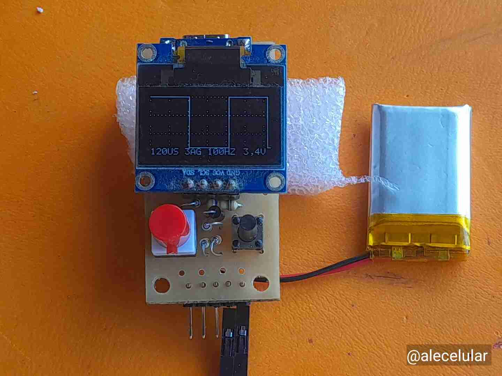

# Nanooscilloscope with ATtiny85

Compact digital oscilloscope based on ATtiny85, with OLED display, signal generator and frequency counter, designed to operate with minimal hardware.

👉 English version [README_en.md](README_en.md)

👉 Versión en castellano, a continuación

---

# Nanoosciloscopio con ATtiny85

Osciloscopio digital compacto basado en ATtiny85, con pantalla OLED, generador de señal y frecuencímetro integrados, diseñado para funcionar con una cantidad mínima de componentes.

## Especificaciones

- MCU: ATtiny85 (principal), adaptable a ATmega328P  
- Display: OLED SSD1306 (128x64 / 128x32)  
- Tiempo por punto: 8/15 µs a 8160 µs  
- Frecuencia máxima útil: ~10 kHz  
- Resolución: 8 bits (ADC interno, efectiva menor)  
- Rangos de entrada: 1V, 3,3V, 5V, 12V  
- Tipo de señal: solo valores positivos  
- Funciones:
  - Osciloscopio
  - Generador de señal
  - Frecuencímetro

## Características
- Muestreo rápido por ADC.
- Visualización en pantalla.
- Generador de señal integrado.
- Escala de tiempo: 10 µs a 8160 µs por punto.
- Mide señales de amplitud de 1V, 3,3V, 5V o 12V, según selección.
- Puede mostrar señales desde 1 Hz hasta aproximadamente 10 kHz.
- Solo para señales de valores positivos.

## Hardware necesario
- ATtiny85 (principal), adaptable a ATmega328P. (Bosquejo para ATtiny84).
- OLED SSD1306.

### Componentes
- R1 10 kΩ
- R2 10 kΩ
- R3 10 kΩ
- R4 100 kΩ
- R5 47 kΩ   (PUL1)
- R6 10 kΩ
- R7 12 kΩ
- R8 47 kΩ
- R9 0 Ω (puente)
- R10 6,8 kΩ (PUL2) Solo para placa de 3 pulsadores
- R11 22 kΩ  (PUL3) Solo para placa de 3 pulsadores
- C1 15 pF
- C2 15 pF 
- C3 10 µF
- C4 100 nF
- DS1=DS2 Schottky 1N5819
- DZ1 Zener 5,6 V (o un valor mayor si se alimenta con VCC>5V)
- Conectores varios
- Pulsadores

Opcionales:
- Interruptor
- Circuito impreso
- Módulo de carga tipo TP4056
- Batería de litio de 3,7 V
- Cristal (mejora la precisión)

## Conexiones y funcionamiento
Ver [Esquema](hardware/Esquema_Nano-Osciloscopio.pdf) y [Detalle del funcionamiento](Funcionamiento_es.md)

## Cómo usar

### Compilación
1. Cargar el código en el IDE de Arduino carpeta `NOS_V1.6.0`. (Archivos NOS_V1.6.0.ino e I2C.ino).
2. Usar opciones indicadas en `NOS_V1.6.0.ino` e `I2C.ino`.
3. Compilar, si se quiere para uno, dos o tres pulsadores, y tipo de OLED (128x64 es 8, 128x32 es 4).
4. Compilador y opciones están indicadas dentro del NOS_V1.6.0.ino y su complemento I2C.ino.
5. Se puede usar un ATmega328P para ensayos (ARDUINO, Nano, Pro Mini), pero no he diseñado circuito impreso para ello.
6. Si se usa cristal, usar la opción de calibración de tensiones de entrada dentro de CONFIG.
7. Si no se usa cristal adicionalmente calibrar la frecuencia con una señal de 50 Hz o 60 Hz.
8. Conectar la señal a la entrada (rangos soportados: 1 V, 3,3/5 V o 12 V según configuración).
9. Ajustar parámetros,

### Puesta en marcha
4. Puede utilizarse ATmega328P para pruebas (Arduino/Nano/Pro Mini).
5. Si se usa cristal: calibrar tensiones en menú CONFIG.
6. Si no se usa cristal: calibrar también frecuencia (50 Hz o 60 Hz).
7. Conectar señal de entrada según rango seleccionado.
8. Ajustar parámetros desde el equipo.

## Limitaciones
- Ancho de banda limitado (~10 kHz).
- Resolución efectiva menor a 8 bits.
- Solo señales positivas.
- Sin memoria de adquisición.
- Trigger básico.
- Precisión dependiente del cristal o calibración sin él.

## Autor
Alejandro F. Fernández  
nanoosciloscopio@gmail.com

## Licencia
Uso no comercial.

Si querés usarlo comercialmente, contactame:
nanoosciloscopio@gmail.com

Se agradece informar mejoras o errores.

## Apoyar el proyecto

Si te resultó útil, podés invitarme un café:

