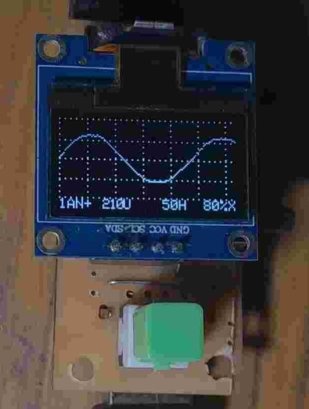
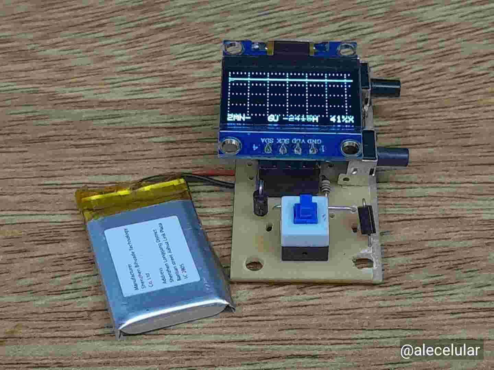
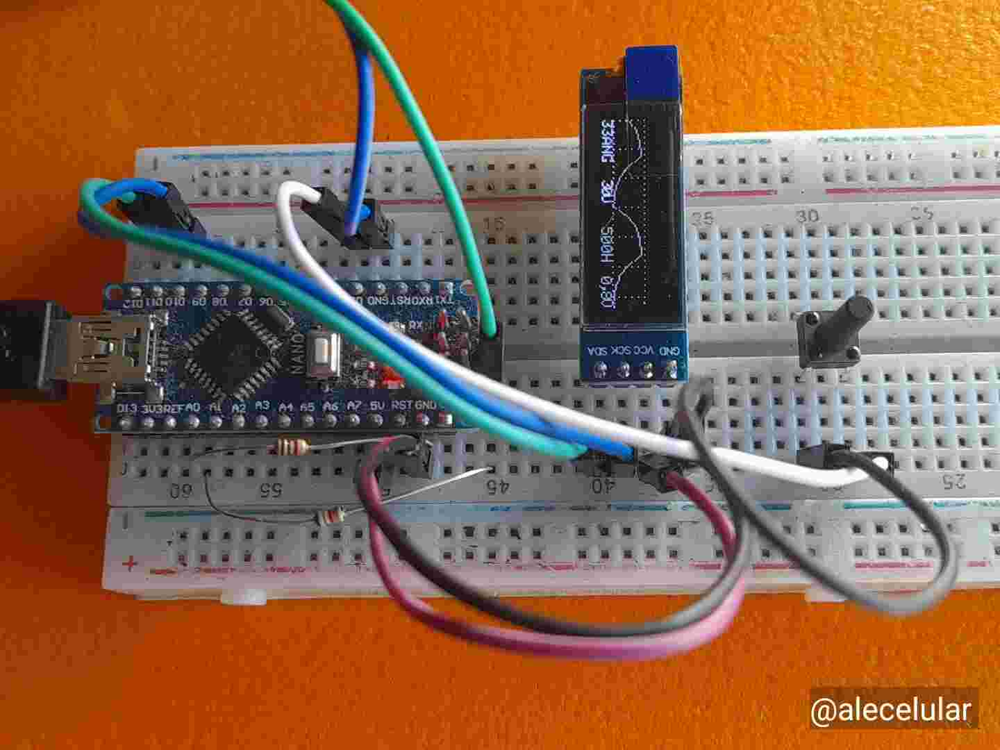

# Nanooscilloscope with ATtiny85

Compact digital oscilloscope based on ATtiny85, with OLED display,
integrated signal generator, frequency counter and temperature
sensor mode, designed to work with a minimal number of components
(only 5 I/O pins on the ATtiny85). It also compiles, without
changing the program logic, for **ATmega328P** (Arduino Nano / Pro
Mini).

👉 Versión en castellano [README.md](README.md)

👉 Versão em português [README_br.md](README_br.md)

👉 English version below

> **Note:** this repository replaces the previous prototype of this
> same project. The base version (**V3.3**) has its own PCB
> (**NOS41**), a different push-button layout than the original
> prototype, and adds the temperature sensor mode. Later versions,
> up to the current one (**V3.5**), add support for 12 and 20 MHz
> crystals, a crystal-less mode (internal RC oscillator calibrated
> against the mains line frequency), and a "nearest calibrated
> neighbor" accessory-detection scheme — while eliminating diodes to
> create a new PCB (**NOS43**) — though the previous board
> remains compatible if those diodes are omitted.
>
> See
> [Funcionamiento_en.md](Funcionamiento_en.md) for the details.

Assembled unit displaying the 50 Hz line frequency.
Note the battery charging port, the input connector, and the side push-buttons.
[](Fotos/50Hz.jpg)

Assembly details:
[](Fotos/ATtiny85/IMG_20260527_131120.jpg)

Prototype with Arduino Nano and 128x32 display
[](Fotos/Arduino_NANO_128x32/IMG_20260410_170244.jpg)

---

## Specifications

- **MCU:** ATtiny85 (main), adaptable to ATmega328P.
- **Display:** OLED SSD1306 (128x64 / 128x32) via bit-banged I2C
  (no extern `Wire.h`, no extern graphics library).
- **Time base:** adjustable, specifically calibrated for 8, 12, 16
  and 20 MHz crystals (with phase correction for the ones that
  don't divide evenly into whole microseconds), and also for the
  crystal-less mode (internal RC, 8 MHz only).
- **Resolution:** 8 bits (internal AVR ADC).
- **Mode selection:** a single ADC pin with a resistive selector —
  no dedicated pin per function.
- **Menu language:** Spanish by default; also builds in English or
  Portuguese.
- **Built-in functions:**
  * Oscilloscope (autoscale, edge trigger, line or dot mode, free
    or triggered sweep, x4 "stretch", freeze capture, minimum-
    amplitude noise filter).
  * Signal generator (square wave, 1 Hz to 25 kHz).
  * Frequency counter (up to ~1 MHz on square signals).
  * Temperature sensor mode (DS18B20 or DHT11/DHT22, autodetect).
- Full on-screen menu for calibration, no PC required, including
  calibrating the internal clock itself when built crystal-less.

---

## Required hardware

- ATtiny85 (main), adaptable to ATmega328P. An **external crystal**
  is best for accurate time/frequency measurements; the device can
  also be built without one (internal RC oscillator, see below), at
  the cost of accuracy and manual calibration.
- OLED SSD1306 (128x64 or 128x32, configurable via `#define`).
- Own PCB design: **NOS43** — see [`hardware/`](hardware/) (source
  in `nos43.xcf`).
- 2 push-buttons.
- Optional: TP4056-type charging module + 3.7 V lithium battery,
  power switch.

### Pins — ATtiny85

| Pin | Function             | Signal       |
|-----|-----------------------|--------------|
| 1   | RESET / Selector      | PB5/ADC0     |
| 2   | Crystal A              | PB3/ADC3     |
| 3   | Crystal B              | PB4/ADC2     |
| 4   | GROUND                | 0 V          |
| 5   | SDA' (I2C bit-bang)    | PB0/AIN0     |
| 6   | SCL' (I2C bit-bang)    | PB1/AIN1     |
| 7   | Out/In/Freq/Sensor     | PB2/ADC1/T0  |
| 8   | Power supply           | VCC          |

> In a crystal-less build, pins 2 and 3 (Crystal A/B) are free for
> another use, since nothing needs to be wired to them.

### Pins — ATmega328P (Arduino Nano, tested)

| Function          | Pin   | Signal |
|-------------------|-------|--------|
| Out/In/Sensor      | A0    | PC0    |
| Frequency counter  | D5    | PD5    |
| SDA' (bit-bang)    | D9    | PB1    |
| SCL' (bit-bang)    | D10   | PB2    |
| Push-button 1      | D2    | PD2    |
| Push-button 2      | D7    | PD7    |
| Selector           | A1    | PC1    |
| AREF capacitor     | AREF  | VREF   |

> ⚠️ On the ATmega328P, the **signal generator output uses the same A0/PC0
> pin** as the oscilloscope input and the sensor — not an
> independent D8/PB0 pin as described at some point previously. See
> `activarGenerador()` in the code: for ATmega328P it toggles
> `PINC=(1<<PC0)` (configured as output with `DDRC|=(1<<PC0)`), and
> only the ATtiny85 uses a dedicated pin (PB2), being the only one
> available besides the selector and the I2C bus.

Full schematics in [`hardware/`](hardware/):
- `Esquema_Nano-Osciloscopio_ATtiny85.pdf` / `.json`
- `Esquema_Nano-Osciloscopio_ATmega328P.pdf` / `.json`
- `nos43.xcf` — NOS43 PCB design.

### Mode selector (a single resistor does it all)

| Resistance  | Approx. ADC | Mode              |
|-------------|------------:|-------------------|
| Short to ground (0 Ω) | ~151 | Oscilloscope 'X'  |
| 5.6 kΩ      | ~172        | Oscilloscope 'Y'  |
| 10 kΩ       | ~186        | Oscilloscope 'Z'  |
| 22 kΩ       | ~203        | Generator         |
| 47 kΩ       | ~221        | Frequency counter |
| 150 kΩ      | ~241        | Sensor            |
| Open (∞)    | ~250-255    | No accessory (waiting mode) |

The values above are the factory defaults. They're stored in
EEPROM and can be recalibrated from the menu itself (all except
Oscilloscope X, which is a fixed short to ground by design); once a
position has been calibrated, the firmware no longer compares
against a fixed window — it detects the plugged-in accessory by
nearest distance to the calibrated value among the 6 positions.
Full details, including the detection algorithm and tolerance
windows, in [Funcionamiento_en.md](Funcionamiento_en.md).

---

## 📷 Prototype evolution

The photos in [`Fotos/ATtiny85/`](Fotos/ATtiny85/) document three
stages of development:

1. **Etched NOS41 board** (05/14) — the freshly made PCB, still
   without components.
2. **Earlier protoboard prototype** (05/15) — an earlier build on
   perforated board, used to test the logic before moving to the
   final PCB.
3. **Assembled NOS41** (05/27 onward) — the final board with all
   components soldered, OLED and battery.

[`Fotos/Arduino_NANO_128x32/`](Fotos/Arduino_NANO_128x32/) also has
photos of the test build on an Arduino Nano with a 128x32 OLED.

---

## ⚡ Signal Generator section

Generates square waves between **1 Hz and over 20 kHz**.
* **How it works:** Reconfigures the Timer and uses the input pin
  as output.
* **Accuracy:** If the frequency is exact, the `=` symbol is shown.
  If it's an approximation, `#` is shown instead.
* **ATmega328P:** The output is generated on the **same input/
  sensor pin (A0/PC0)** — not on an independent pin — so as not to
  add a dedicated pin beyond the ones already used by the
  oscilloscope and sensor.

## 📈 Frequency Counter section

Measures the frequency of square waves (0 to VCC logic level)
injected into the input pin, easily reaching **1 MHz**.
* **ATtiny85:** Uses the internal **T0** counter. Compiling without
  `millis()` is essential to avoid conflicts with the time-base
  counter.
* **ATmega328P:** Uses the **T1** counter on pin **D5**, which lets
  the measurement input be separate from the frequency input.
* *Note:* For non-square signals below 10 kHz, using
  **Oscilloscope Mode** is recommended.

---

## 🚀 Introduction

The documentation and code are mainly focused on the **ATtiny85**.
However, the system has been adapted to be compatible with the
**ATmega328P**.

> **Note:** A tentative description exists for using an
> **ATtiny84**, although no specific code adapted for this model is
> included at this time.

### Software requirements

To compile the code for the **ATtiny85**, **Arduino IDE 1.8.19**
was used, with the following indispensable settings:
* **Core:** [ATtinyCore 1.5.2](http://drazzy.com/package_drazzy.com_index.json)
* **Compile options:**
    * `No millis()` (Mandatory to maximize Flash and avoid
      conflicts with the counters used by the frequency counter
      and generator).
    * `LTO enabled`.
    * `No bootloader`.

For **ATmega328P**, simply select that board (Arduino Nano / Pro
Mini) in the IDE — the same `.ino` detects the MCU via
`#if defined(__AVR_ATtiny85__)` and automatically adjusts pins,
timers and peripherals.

### Crystal / clock source selection

The firmware internally validates the oscilloscope time scales for
**8, 12, 16 and 20 MHz**, so in ATtinyCore you can pick any of those
four crystals depending on your needs (**Tools → Clock** menu):

| Crystal | Best for                                              | Safe minimum Vcc |
|---------|--------------------------------------------------------|-------------------|
| 8 MHz   | Battery power (lower consumption)                       | ~2.7 V            |
| 12 MHz  | Middle ground                                           | ~3.3 V            |
| 16 MHz  | External 5 V supply (higher precision/speed)            | ~4.5 V            |
| 20 MHz  | Maximum speed, needs Vcc close to nominal               | ~5.0 V            |

### Crystal-less mode (internal RC oscillator) — ATtiny85 only

The device can also be built without an external crystal, using the
ATtiny85's internal RC oscillator at 8 MHz (**Clock Source →
Internal 8 MHz** in ATtinyCore, or any build where the core defines
`CLOCK_SOURCE==0`). This frees up the two crystal pins (2 and 3) for
another use, but the internal RC oscillator isn't accurate out of
the box, nor stable with temperature, so it needs to be calibrated
against a known frequency (50 or 60 Hz mains) from the device's own
menu. The step-by-step procedure is in
[Funcionamiento_en.md](Funcionamiento_en.md).

> ⚠️ This option only compiles at 8 MHz: at any other frequency with
> `CLOCK_SOURCE==0` the `.ino` deliberately fails to compile ("No
> puede usarse sin Cristal que no sea a 8 MHz y solo para pruebas"),
> since the calibration only makes sense at that speed.

### Enabling the internal RC oscillator on ATmega328P (MiniCore)

The native Arduino core for ATmega328P has no clock-source option:
it always assumes an external crystal. To also build an Arduino
Nano / Pro Mini (ATmega328P) without a crystal, you need the
[MiniCore](https://github.com/MCUdude/MiniCore) core and a line
added to its `boards.txt`, e.g.:

```
~/.arduino15/packages/MiniCore/hardware/avr/<version>/boards.txt
```

Find that board's "Internal 8 MHz" option block and add, at the
end of that block, a line passing the equivalent build flag:

```
328.menu.clock.8MHz_external.build.extra_flags=-DCLOCK_SOURCE=0
```

> The exact key name (`328.menu.clock.<something>`) may differ
> depending on your installed MiniCore version. Open your own
> `boards.txt`, locate the actual "Internal 8 MHz" block, and add
> the line there, rather than assuming the key above matches your
> installation letter for letter.

### Menu language

By default the firmware compiles with menu text in Spanish
(`IDIOMA_ES`, implicit). To build it in English or Portuguese, add
one of these lines near the top of the `.ino`, before the rest of
the definitions:

```cpp
#define IDIOMA_EN   // English
#define IDIOMA_BR   // Portuguese
```

### Signal-detection fine-tuning

`AMPLITUD_MINIMA_DETECCION` (in the `.ino`, 4 ADC counts by
default) is the minimum amplitude threshold for the firmware to
consider a capture a real signal rather than background noise, both
for computing frequency and for locating the trigger point. If the
device "invents" a frequency with nothing connected to the input,
raise this value; if it instead ignores genuinely small real
signals, lower it.

### Getting started

1. Load the code from [`src/`](src/) (`NOS_V3.2.ino` +
   `I2C.ino`).
2. Program the ATtiny85 via ISP (see the ISP pin table at the top
   of the `.ino`), or upload directly if using an Arduino Nano/Pro
   Mini.
3. Calibrate input voltages from the configuration menu.
4. Connect the signal to measure and adjust parameters from the
   device itself.

---

## Repository structure

```
.
├── src/
│   ├── NOS_V3.5.ino     # Main program: ADC, timers, menus, modes
│   └── I2C.ino          # Software I2C driver (bit-banging) for the OLED
├── hardware/
│   ├── Esquema_Nano-Osciloscopio_ATtiny85.pdf/.json
│   ├── Esquema_Nano-Osciloscopio_ATmega328P.pdf/.json
│   └── nos43.xcf         # Graphic source (GIMP) related to the design
├── Fotos/
│   ├── ATtiny85/              # Assembled NOS41/NOS43 prototype
│   └── Arduino_NANO_128x32/   # Test prototype on Arduino Nano
├── README.md
├── README_en.md
├── README_br.md
├── Funcionamiento_es.md
├── Funcionamiento_en.md
├── Funcionamiento_br.md
├── LICENSE_es
└── LICENSE_en
```

---

## Known limitations

- Without an external crystal, time/frequency accuracy depends on a
  manual calibration of the internal RC oscillator (ATtiny85 only,
  8 MHz only) and can drift with temperature.
- Basic trigger, no extended acquisition memory.
- ATmega328P support tested less extensively than ATtiny85.

## Contributions

Suggestions, fixes and hardware variants are welcome via issues or
pull requests. Feedback on improvements or bugs is appreciated.

## Author

Alejandro F. Fernández (alecelular)
[nanoosciloscopio@gmail.com](mailto:nanoosciloscopio@gmail.com)

## License

Non-commercial use — see [`LICENSE_es`](LICENSE_es) /
[`LICENSE_en`](LICENSE_en).

If you want to use it commercially, contact:
[nanoosciloscopio@gmail.com](mailto:nanoosciloscopio@gmail.com)

## Support the project

If you found this useful, you can buy me a coffee:
[](https://cafecito.app/rsp148)

---

*I hope you enjoy this project as much as I enjoyed developing it.*
